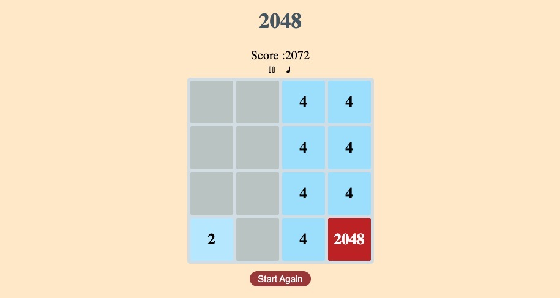

# \\\\- 2048 -// 

2048 is played on a simple 4×4 grid, with numbered tiles sliding as the player uses the four arrow keys to move them. When the game starts, there are already two tiles with a value of 2 or 4 in the grid, and after each turn, another such tile will appear in a random empty space. The block slides as far as possible in the selected direction until stopped by another block or a grid edge. If two blocks with the same number collide while moving, they will merge into one block whose value is the sum of the two colliding blocks.

[Play the game here](https://2048zk.netlify.app/)

___

##  Technologies used

___
##  Credits
